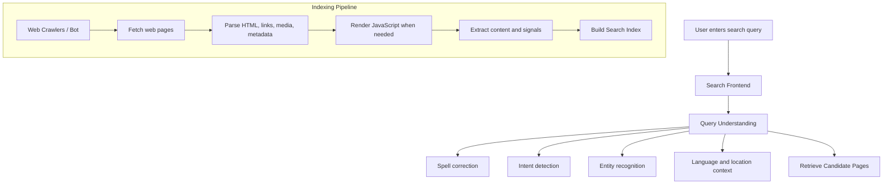

# MD Activator

A local-first, lightweight Markdown workflow tool for AI-assisted development.

Turn plain `.md` files into interactive pages with checkboxes, progress bars, Mermaid diagrams, editable text blocks, buttons, and write-back updates.

## Start

```bat
start_md.bat
```
or
```bash
bash start_md.sh
```

Then open <http://127.0.0.1:8000>

Reference http://127.0.0.1:8000/development_progress.md

To use a different port, pass `--port <port>`

To use a different folder, pass `--cd <folder>`

## Screen Shot


## What it does

MD Activator serves Markdown files from a local folder and renders them as interactive browser pages.

It supports:

- Markdown viewing
- Mermaid diagram rendering
- image and link rendering
- task checkboxes with write-back updates
- progress bars generated from task lists
- editable text blocks with save-back behavior
- button-style checklist actions

## Use cases

- AI-assisted development notes
- human-in-the-loop task workflows
- requirement analysis documents
- implementation progress tracking
- lightweight local project dashboards
- Markdown-based issue execution plans

## Safety note

MD Activator is designed for local use. It reads and updates Markdown files from the selected content folder.

Do not expose the server directly to the public internet unless you have added proper authentication, authorization, and network-level protection.

## Notes

```text
- The server reads markdown files from the folder where you start it unless a content root override is provided.
- Default file is `README.md`.
- Relative links ending in `.md` are opened inside the app.
- Table, URL, Image, Mermaid will be rendered as html page components. File name will be rendered as url and downloadable.
- Double click a text box enable editing the text. After editing, mouse click outside of the editor will auto save 
	the changes back to the original .md file.
- Task markers like `[ ]` and `[x]` at the start of a line are rendered as checkboxes and checkable. The check/uncheck 
	value will be updated to the original .md file.
- `[ ]` and `[x]` followed with "[<text>]" be rendered as button with check indicator. Click the button will switch the 
	check icon display, and the change will be updated to the original .md file.
- `[ ]` and `[x]` with "progress" in the above line will be rendered as step progress bar and read only. 
```

## Optional root override

Pass `--cd <folder>` to serve markdown from another folder:

```bash
start_md.bat run python -m app.main --cd /path/to/notes --reload
```

When starting Uvicorn directly, set `MD_VIEWER_ROOT` before starting the server:

```bash
MD_VIEWER_ROOT=/path/to/notes uvicorn app.main:app --reload
```

Content root precedence is `--cd`, then `MD_VIEWER_ROOT`, then the process working directory.

## Windows quick launch (.bat)

From PowerShell or CMD:

```bat
start_md.bat
```

The launcher uses `uv sync --quiet` to create/update `.venv` from `pyproject.toml`,
then starts the app with `uv run --no-sync`.

Optional: serve a specific folder:

```bat
start_md.bat C:\path\to\notes
```

Optional: start on a different port:

```bat
start_md.bat -p 8124 C:\path\to\notes
```

## Show Table
| Library             | Good with Quasar? | Main use                 |
| ------------------- | ----------------: | ------------------------ |
| Bootstrap           |        Usually no | Overlapping UI framework |
| Mermaid.js          |               Yes | Diagrams                 |
| PrismJS             |               Yes | Code highlighting        |


## Double Click to change content. Click else where to save changes
```text
Test content 2
```


## Enable/Disable Options - Check Box

```text
[] Option 1
[x] Option 2
[] Option 3
[x] Option 4
```

## Step Progression Bar

```text
progress
[X] Step 1 Activate the code and do something
[x] Step 2 Dectivate the code and do something
[] Step 3
[] Step 4
[] Step 5
[] Step 6
```

## Button

```text
[] [confirm]
```

## List

```text
- Primary item
- Secondary item
  - Nested item


1. First operation
2. Second operation
```


## Hyper link
```text
[GitHub](https://github.com)
```

## Show Picture

```text
img/website_bird_protection.png
```

## Test Mermaid

````text



````
