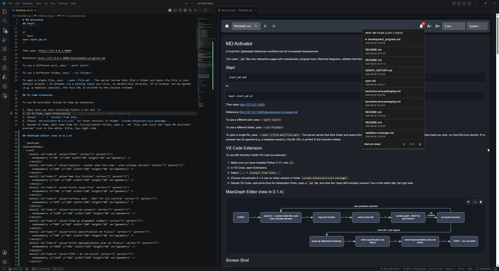
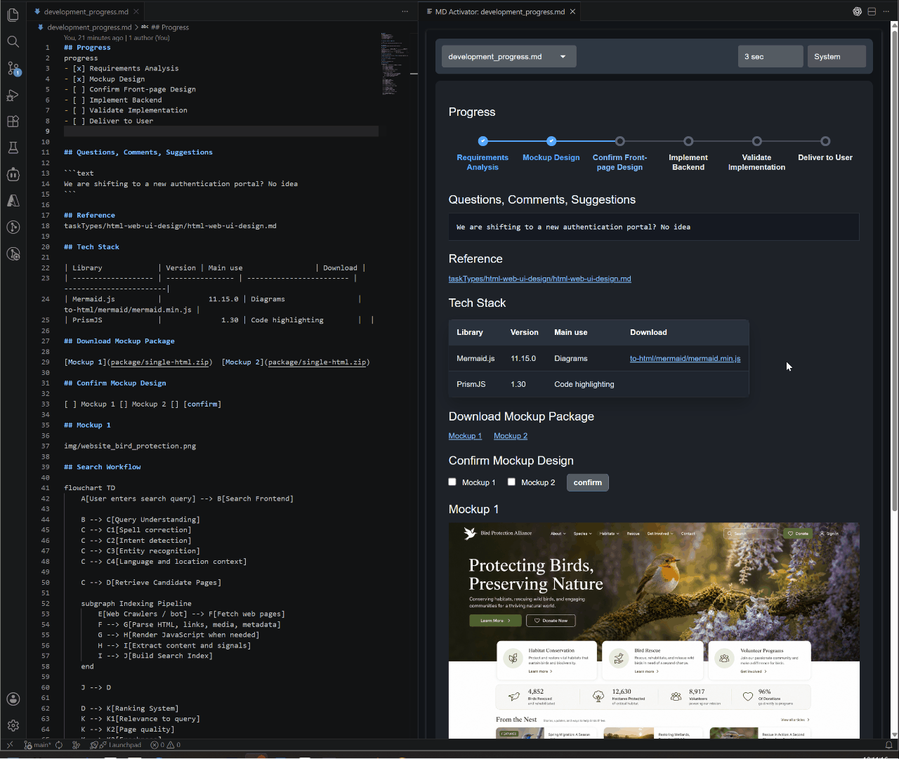
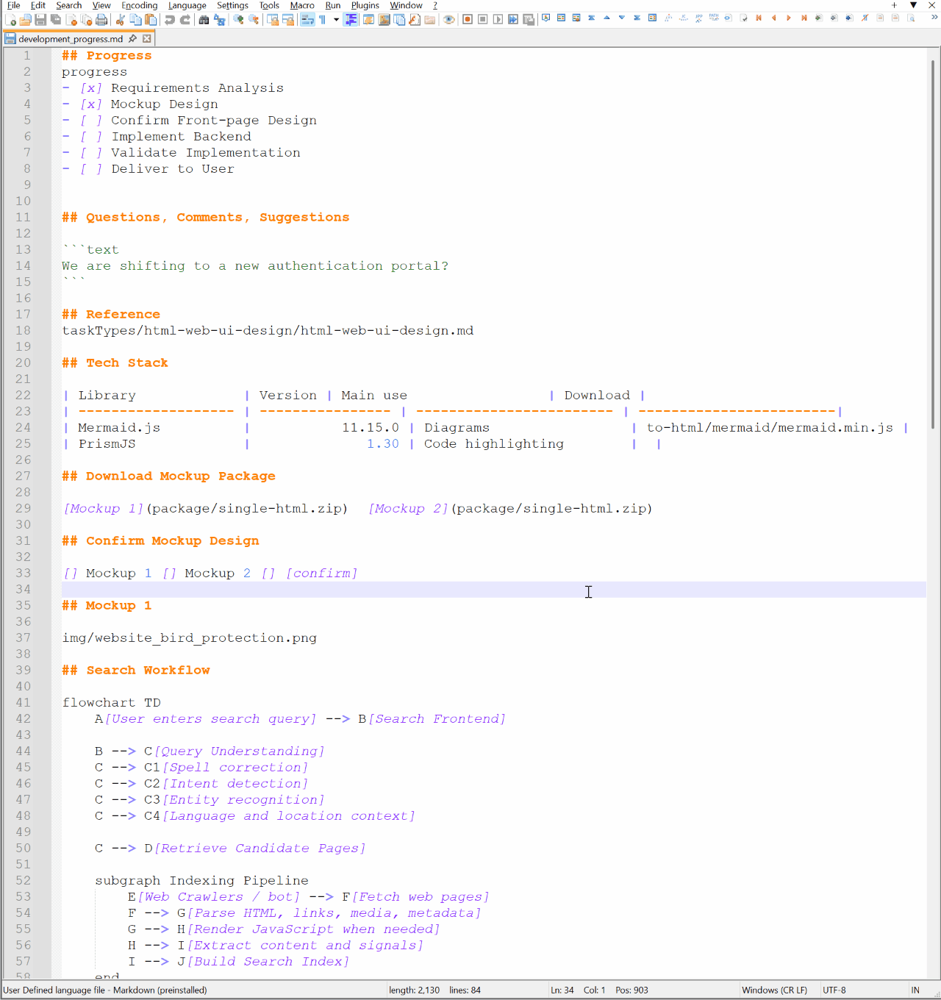
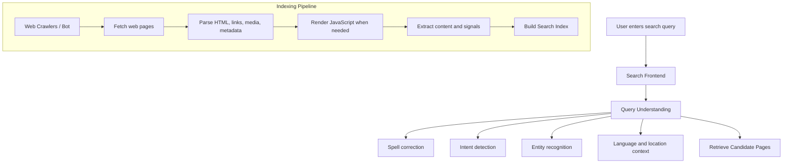

# MD Activator

A local-first, lightweight Markdown workflow tool for AI-assisted development.

Turn plain `.md` files into interactive pages with checkboxes, progress bars, Mermaid diagrams, editable text blocks, buttons, and write-back updates.

## Install & Run

Make sure you have installed Python 3.11+ and `uv`.

```code
uv tool install git+https://github.com/khtwo/md-activator
```

then 

```code
md-activator <parameters>
```
## Upgrade to latest after install

```code
uv tool upgrade md-activator
```

## Clone

Clone repo to local

```bat
start_md.bat
```
or
```bash
bash start_md.sh
```

Then open <http://127.0.0.1:8000>

Reference http://127.0.0.1:8000/development_progress.md

To use a different port, pass `--port <port>`

To use a different folder, pass `--cd <folder>`

To open a single file, pass `--open <file.md>`. The server serves that file's folder and opens the file in your default browser — on Windows via a desktop toast you click, on macOS/Linux directly. If no browser can be opened (e.g. a headless session), the file URL is printed to the console instead.

## VS Code Extension

To use MD Activator inside VS Code as extension:

1. Make sure you have installed Python 3.11+ and `uv`.
2. In VS Code, open Extensions. 
3. Select `...` > `Install from VSIX...`.
4. Choose `md-activator-0.1.6.vsix` (or other version) in folder `vscode-extension/vsix-package/`.
5. Reload VS Code, wait some time for initialization finish, open a `.md` file, and click the "open MD Activator preview" icon in the editor title, top right side.

## Screen Shot
0.1.4

0.1.2




## What it does

MD Activator serves Markdown files from a local folder and renders them as interactive browser pages.

It supports:

- Markdown viewing
- YAML front matter (a leading `---` ... `---` block) rendering as a key/value table at the top of the page, the way GitHub and the VS Code preview show it
- YAML (`.yml`/`.yaml`) rendering as a collapsible indentation tree, with a `+`/`-` toggle on every line that has children (all nodes expanded by default)
- JSON (`.json`/`.jsonl`) rendering as a pretty-printed, collapsible value tree, with a `+`/`-` toggle on every object/array that has children (all nodes expanded by default)
- Mermaid diagram rendering, title editing
- MaxGraph diagram rendering, title editing, entity moving, edge auto layout
- image and link rendering
- task checkboxes with write-back updates
- progress bars generated from task lists
- editable text blocks with save-back behavior
- button-style checklist actions
- a toolbar notification bell that lists markdown files created in the last 2 days (newest first, 10 per page), badges the unviewed count, and remembers which files you have opened across restarts and across changes of served folder, in a per-user registry keyed by absolute path (unviewed shown in bold, viewed in normal weight); files and folders excluded by git's ignore rules are skipped
- a second toolbar bell for *clarification files* — recently-created markdown files that still contain an unchecked `[ ] Confirm` marker — badging how many need review and listing them so you can open and confirm each; ticking a file's confirm box removes it from the list on the next refresh

## Use cases

- AI-assisted development notes
- human-in-the-loop task workflows
- requirement analysis documents
- implementation progress tracking
- lightweight local project dashboards
- Markdown-based issue execution plans

## Safety note

MD Activator is designed for local use. It reads and updates Markdown files from the selected content folder.

Do not expose the server directly to the public internet unless you have added proper authentication, authorization, and network-level protection.

## Notes

```text
- The server reads markdown files from the folder where you start it unless a content root override is provided.
- Default file is `README.md`.
- Relative links ending in `.md` are opened inside the app.
- Table, URL, Image, Mermaid will be rendered as html page components. File name will be rendered as url and downloadable.
- A leading YAML front matter block (a `---` ... `---` block at the very start of the file) is rendered as a key/value table at the top of the page instead of as body text. The rest of the document keeps its original line numbers, so checkboxes below the block still save correctly.
- Double click a text box enable editing the text. After editing, mouse click outside of the editor will auto save 
	the changes back to the original .md file.
- Task markers like `[ ]` and `[x]` at the start of a line are rendered as checkboxes and checkable. The check/uncheck 
	value will be updated to the original .md file.
- `[ ]` and `[x]` followed with "[<text>]" be rendered as button with check indicator. Click the button will switch the 
	check icon display, and the change will be updated to the original .md file.
- `[ ]` and `[x]` with "progress" in the above line will be rendered as step progress bar and read only. 
```

## Optional root override

Pass `--cd <folder>` to serve markdown from another folder:

```bash
start_md.bat run python -m app.main --cd /path/to/notes --reload
```

When starting Uvicorn directly, set `MD_VIEWER_ROOT` before starting the server:

```bash
MD_VIEWER_ROOT=/path/to/notes uvicorn app.main:app --reload
```

Content root precedence is `--cd`, then `MD_VIEWER_ROOT`, then the process working directory.

## Open a single file

Pass `--open <file.md>` to serve that file's parent folder and jump straight to the file:

```bash
python -m app.main --open C:\path\to\notes.md
```

On Windows 11 a desktop toast titled `MD Activator` appears once the server is ready;
clicking it opens `http://127.0.0.1:8000/notes.md` in your default browser. On macOS/Linux
the file opens in your default browser directly once the server is ready. If the browser
can't be opened — the Windows toast can't be shown, or a headless macOS/Linux session with
no browser — the file URL is printed to the console instead. When `--open` is given it
selects the content root from the file's folder, so a co-supplied `--cd` is ignored.

An `--open` server cleans up after itself: once it has received its first request, if no
request arrives for 2 minutes it shuts down automatically. Any request resets the timer —
including the viewer's background auto-refresh (every few seconds) — so the server keeps
running while you have the page open and exits a couple of minutes after you close the tab.
(This only applies to `--open` mode.) `--open` runs as a single process (auto-reload is
disabled, overriding any `--reload`), so it can fully shut itself down and free the port;
auto-reload is a development feature and is irrelevant when viewing a single file.

## Windows quick launch (.bat)

From PowerShell or CMD:

```bat
start_md.bat
```

The launcher uses `uv sync --quiet` to create/update `.venv` from `pyproject.toml`,
then starts the app with `uv run --no-sync`.

Optional: serve a specific folder:

```bat
start_md.bat C:\path\to\notes
```

Optional: start on a different port:

```bat
start_md.bat -p 8124 C:\path\to\notes
```

## Show Table
| Library             | Good with Quasar? | Main use                 |
| ------------------- | ----------------: | ------------------------ |
| Bootstrap           |        Usually no | Overlapping UI framework |
| Mermaid.js          |               Yes | Diagrams                 |
| PrismJS             |               Yes | Code highlighting        |


## Double Click to change content. Click else where to save changes
```text
Test content 2
```


## Enable/Disable Options - Check Box

```text
[] Option 1
[x] Option 2
[] Option 3
[x] Option 4
```

## Step Progression Bar

```text
progress
[X] Step 1 Activate the code and do something
[x] Step 2 Dectivate the code and do something
[] Step 3
[] Step 4
[] Step 5
[] Step 6
```

## Button

```text
[] [confirm]
```

## List

```text
- Primary item
- Secondary item
  - Nested item


1. First operation
2. Second operation
```


## Hyper link
```text
[GitHub](https://github.com)
```

## Show Picture

```text
img/website_bird_protection.png
```

## Test Mermaid

````text



````

## Documentation

Project documentation lives under [`doc/`](doc/) — see **[`doc/README.md`](doc/README.md)** for the folder-structure map. Categories:

- [`doc/specification/`](doc/specification/) — *what* the product does (behavior, contracts, API, UX).
- [`doc/requirements/`](doc/requirements/) — *why* it exists.
- [`doc/tech-stack/`](doc/tech-stack/) — *what* it's built with.
- [`doc/engineering/`](doc/engineering/) — *how* to build, test, wire, and release it (conventions + runbooks).
